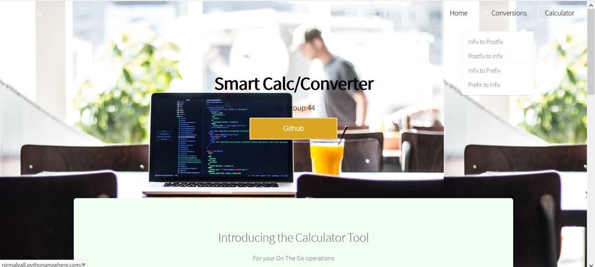
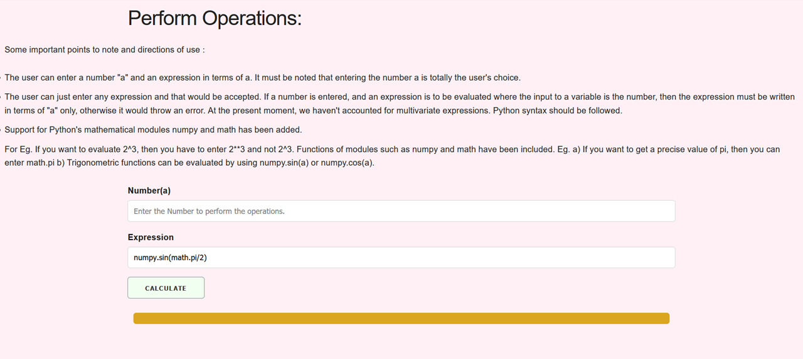

# Live Demo
For a live demo of our project, you can check: http://nirmalya8.pythonanywhere.com/ 
It is advised to go through the directions of use before moving into the live demo. The directions of use are also present in each part of the website. Hope you like it!!

# CalculateAndConvert
Our project Calculate And Convert basically consists of a) A calculator which can evaluate expressions and b) A converter. The details of these are mentioned below. Our website is made using the following - 
1. HTML and CSS - For the frontend design of the website. 
2. Flask - For making the website and its various buttons responsive.
3. Python - To code up the different computations and conversions.

First, we will take a look at the Calculator part.

# Calculator
In python, we have a very powerful method for performing complex computations which is the eval() function. In the eval() function, we can pass an expression(String) as an argument and that expression will be evaluated. Say we pass the String "2+2" into the function as eval("2+2"), we will get the output as 4 . 
Some important points to note and directions of use :
1. The user can enter a number "a" and an expression in terms of a. It must be noted that entering the number a is totally the user's choice. The user can just enter any expression and that would be accepted. 
2. If a number is entered, and an expression is to be evaluated where the input to a variable is the number, then the expression must be written in terms of "a" only, otherwise it would throw an error. At the present moment, we haven't accounted for multivariate expressions.
3. Python syntax should be followed. For Eg. If you want to evaluate 2^3, then you have to enter 2**3 and not 2^3.
4. Functions of modules such as numpy and math have been included. Eg. a) If you want to get a precise value of pi, then you can enter math.pi b) Trigonometric functions can be evaluated by using numpy.sin(a) or numpy.cos(a).

# Conversions
The following part is about the conversions which can be performed using our web app. Our app focuses on converting expressions -
1. Infix to Postfix Converter 
2. Postfix to Infix Converter
3. Infix to Prefix Converter
4. Prefix to Infix Converter

Some general directions of use are as follows- 
1. Expressions entered must not contain whitespaces. Eg. Enter A+B-C*D/E instead of A + B - C * D / E
2. For all conversions the process will be displayed alongwith the final output, but the process displayed might not be the conventional one, it would be the process with the help of which the conversion takes place behind the scenes. 
3. Expressions with both letters and numbers can be converted. 
4. Press calculate after entering expression.

# DEPLOYMENT
For deployment, we have used the pythonanywhere service: www.pythonanywhere.com . The process used for Deployment is:
1. Head over to the pythonanywhere website and create an account, choosing the plan which suits you. We chose the Beginner Account Free Plan.
2. Open up Consoles and then open a Bash console. 
3. In the bash console, clone the repository using git clone using a virtual environment.
4. Install the basic requirements, which are the basic modules imported, in this case which are Flask and numpy, using the requirements.txt file and the command pip install-r requirements.txt .
5. Open web and Create a New web app and set the path of the source code and the name of the virtual environment. 
6. Open the WSGI configuration file and make the required edits(uncomment out the flask portion, etc)
7. FInally reload the website and open the link to see your deployed website.

The code for the bash console is basically creating a virtual environment, then cloning the repository and finally installing the required packages. The WSGI Configuration file has been uploaded in the PythonAnywhere Deployment Files. The error logs are there as well. 

# THE END
Thank you for visiting the repository and we hope you liked it!

